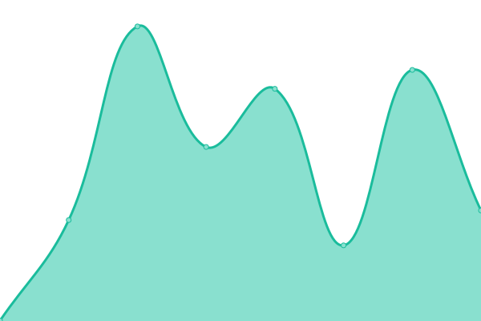
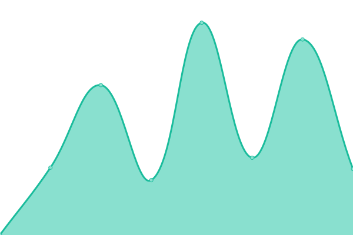

# VocaDB Upptime (unofficial)

Welcome to the unofficial Upptime status page for **[VocaDB](https://vocadb.net)**.

This is the status repository for [VocaDB](https://vocadb.net) and other adjacent services, provided by [Hans5958](https://hans5958.github.io). While there is [an official status page](https://vocadb.openstatus.dev/), I made this to track the latency of the site.

It monitors them for free using GitHub services, thanks to [Upptime](https://github.com/upptime/upptime).

Live status: <!--live status--> **🟩 All systems operational**

## [📈 Status](https://scratch-upptime.netlify.app)

<!--start: status pages-->
<!-- This summary is generated by Upptime (https://github.com/upptime/upptime) -->
<!-- Do not edit this manually, your changes will be overwritten -->
<!-- prettier-ignore -->
| URL | Status | History | Response Time | Uptime |
| --- | ------ | ------- | ------------- | ------ |
|  [VocaDB](https://vocadb.net) | 🟩 Up | [voca-db.yml](https://github.com/Hans5958/VocaDB-Upptime/commits/HEAD/history/voca-db.yml) | 

 137ms
     
 | 

<a href="https://Hans5958.github.io/VocaDB-Upptime/history/voca-db">100.00%</a>
    

|  [UtaiteDB](https://utaitedb.net) | 🟩 Up | [utaite-db.yml](https://github.com/Hans5958/VocaDB-Upptime/commits/HEAD/history/utaite-db.yml) | 

 565ms
     
 | 

<a href="https://Hans5958.github.io/VocaDB-Upptime/history/utaite-db">100.00%</a>
    

|  [TouhouDB](https://touhoudb.com) | 🟩 Up | [touhou-db.yml](https://github.com/Hans5958/VocaDB-Upptime/commits/HEAD/history/touhou-db.yml) | 

 618ms
     
 | 

<a href="https://Hans5958.github.io/VocaDB-Upptime/history/touhou-db">100.00%</a>
    

<!--end: status pages-->

## 📄 License

- Code: [MIT](./LICENSE)
- Data in the `./history` directory: [Open Database License](https://opendatacommons.org/licenses/odbl/1-0/)
